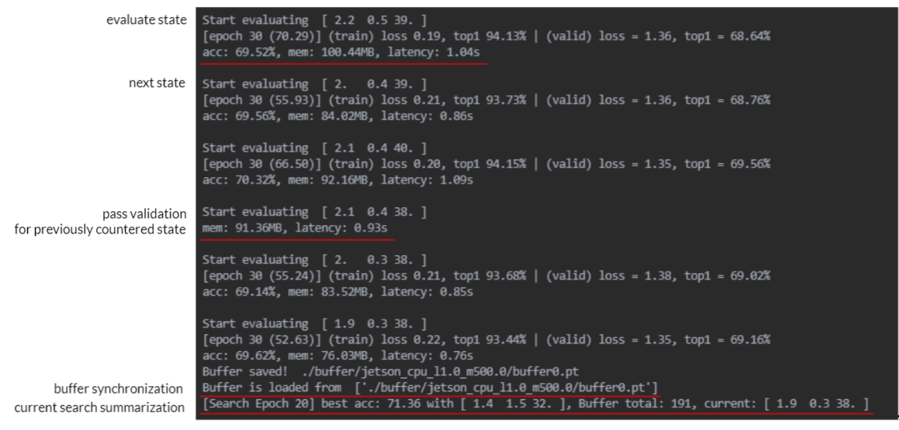

# aisys2021_AutoML
AutoML System team project page (AI system 2021 class).

The main objective of this project is to build an **automatic RL search algorithm** for network scaling. 

### Requirements 
These codes are tested with
```
Python3 == 3.8.5
PyTorch == 1.7.0
torchvision == 0.8.0
CUDA == 10.2

[Python Packages] PyYAML, parse
```

### Environment Setup Commands
The below commands were verified on clean **ubuntu 20.04 container** (link: https://hub.docker.com/_/ubuntu , tag: *latest*)
```
apt-get update
apt-get install python3 python3-pip git
pip3 install torch torchvision PyYAML parse
git clone https://github.com/Janghyun1230/aisys2021_AutoML.git
```

### To implement NAS scaling algorithm
```
python3 main.py -p [platform] -v [device] --latency [latency bound] --mem [memory bound] --id [process number]
```
**Arguments**  
- platforms: ***raspberrypi*** , ***jetson*** , ***desktop***   
- device: ***cpu*** , ***cuda*** (only for jetson, desktop)
- latency: required latency bound in second (**s**)
- mem: required memory bound in **MB** 

If running multi-process for the certain experimental setting (platform, device, latency, mem bounds), each process should have different id.

The code will return the *best scale parameter* and its *validation accuracy* from the search so far. The log will be


Note, the state (in the log, 'start evaluating [state]') corresponds to a **scale parameter (width, depth, resolution)**.

**Our experiment on raspberrypi**, 
```
python main.py -p raspberrypi -v cpu --latency 5 --mem 10   
python main.py -p raspberrypi -v cpu --latency 5 --mem 100
```
| Setting  | Best state parameter (w,d,r) | Accuracy | Latency | Memory | 
| ------------- | ------------- | ------------- | ------------- | ------------- |
| latency 5s, mem 10MB | (0.6, 0.6, 32) | 66.6 % | 3.01 s | 9.05 MB |
| latency 5s, mem 100MB | (1.0, 1.0, 32) | 71.3 % | 1.96 s | 48.18MB |

**Our experiment on Jeston** run, 
```
python main.py -p jetson -v cpu --latency 1 --mem 500 -d 2.0 -w 2.0
python main.py -p jetson -v gpu --latency 1 --mem 500 -d 2.0 -w 2.0
```
| Setting  | Best state parameter (w,d,r) | Accuracy | Latency | Memory | 
| ------------- | ------------- | ------------- | ------------- | ------------- |
| CPU latency 1s, mem 500MB | (1.4, 1.5, 32) | 71.18 % | 0.89 s | 91.7 MB |
| GPU latency 1s, mem 500MB | (1.9, 1.1, 36) | 71.34 % | 0.35s | 167.5 MB |


**Notes**
- Using the default setting (training on 30 epochs), it will take about 20 min (tested on single RTX-2080Ti) for each evaluation of scale parameters. 
- How much time to run the search will depend on the constraints and device settings. (generally 1~2 weeks on single GPU is sufficient)
- The minimal search scale parameter is (0.1, 0.1, 4). If there are no parameter satisfying the constraints, "*There are no possible architecture satisfying constraints!*" will be returned. 


### To test a certain scale parameter
```
python3 env.py -p [platform] -v [device] -w [width] -d [depth] -r [resolution] -e [training epoch]
```
This command will print model and return evaluation results including validation accuracy, latency, and memory.


### To test a search algorithgm on Toy Env
```
python3 test.py 
```
For details, please refer to our ppt slides 7, 8.
